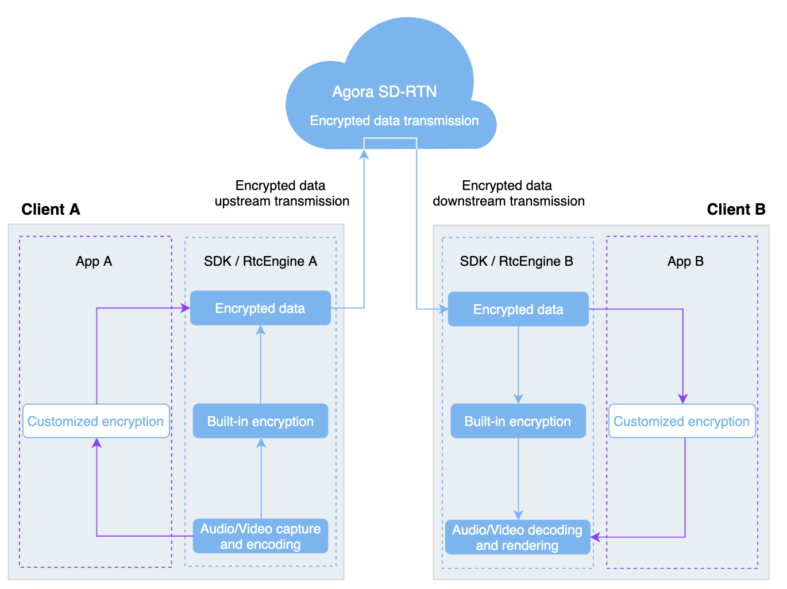

## Introduction

The Agora Web SDK NG provides methods for you to implement built-in encryption and set encryption password.

> - Both the Communication and Live-broadcast scenarios support channel encryption. For live broadcasts, if you need to use CDN for streaming, recording, and storage, do not use channel encryption.
> - Ensure that both receivers and senders use channel encryption, otherwise, you may meet undefined behaviors such as no voice and black screen.

The following figure shows how Agora’s communications use built-in encryption:



## Implementation

Before proceeding, ensure that you have implemented the basic real-time communication function in your project. For details, see [Implement a Basic Video Call](basic_call.md).

The `client` object in the following sample code is created by calling `AgoraRTC.createClient`.

```js
// Sets encryption mode to "aes-128-xts","aes-256-xts" or "aes-128-ecb".
// Set the encryption password
client.setEncryptionConfig(encryptionMode, password);
```

### API reference
- [`AgoraRTCClient.setEncryptionConfig`](/api/en/interfaces/iagorartcclient.html#setencryptionconfig)

## Considerations
Call `AgoraRTCClient.setEncryptionConfig` before joining a channel.

